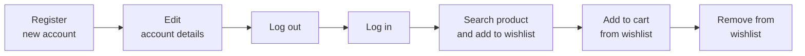
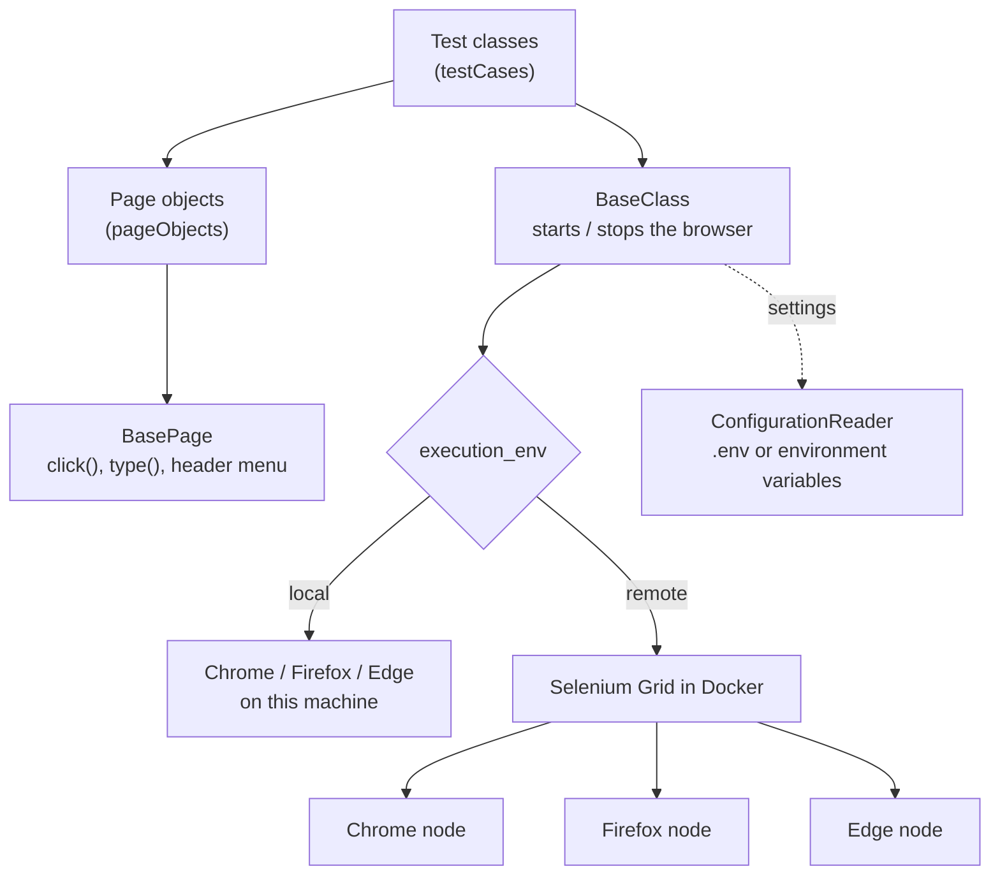
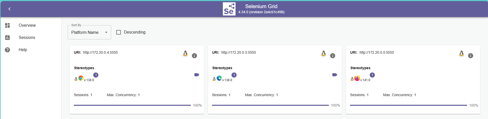
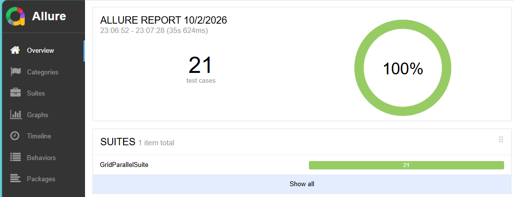
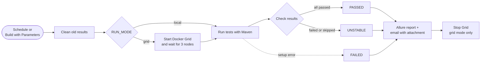
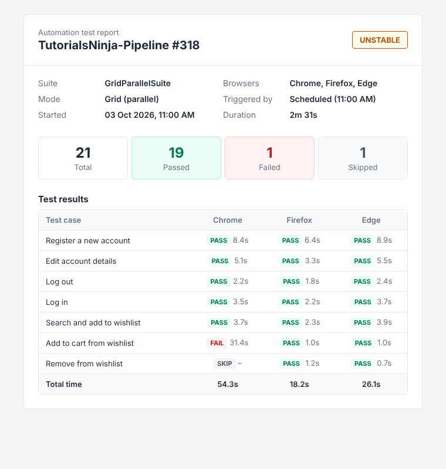

# TutorialsNinja Hybrid Automation Framework

UI test automation for the [TutorialsNinja demo store](https://tutorialsninja.com/demo/), written in Java with Selenium 4 and TestNG.

The same tests run in three places:

- on your machine, in Chrome
- on a Docker Selenium Grid, in Chrome, Firefox and Edge at the same time
- in Jenkins, on a schedule, with an HTML report emailed after every run

## Contents

- [What gets tested](#what-gets-tested)
- [How the framework is put together](#how-the-framework-is-put-together)
- [Project layout](#project-layout)
- [Getting started](#getting-started)
- [Running the tests](#running-the-tests)
- [Reports](#reports)
- [Jenkins pipeline](#jenkins-pipeline)
- [Adding a test](#adding-a-test)
- [Known limitations](#known-limitations)

## What gets tested

The suite follows a single customer journey. Each step picks up where the previous one left off, so the tests are chained with TestNG `groups` and `dependsOnGroups`.



| Test class | What it checks |
|---|---|
| `RegisterAccountTest` | Account is created ("Your Account Has Been Created!") |
| `EditAccountTest` | Account details are saved |
| `LogoutTest` | The "Account Logout" page is shown |
| `LoginTest` | Login works with the account created in the first step |
| `SearchAndAddToWishlistTest` | Correct product opens, and the wishlist shows the same name and price |
| `AddToCartFromWishlistTest` | The wishlist item is added to the cart |
| `RemoveFromWishlistTest` | The wishlist is empty afterwards |

If one step fails, every step after it is marked **skipped**, not failed. One broken feature therefore shows up as one failure in the report, not seven.

## How the framework is put together



A few decisions worth knowing about before you change anything:

**Page objects act and read, tests assert.** Page classes click, type and return values (`getConfirmationText()`, `getProductPrice()` and so on). All `Assert` calls live in the test classes, so a failing test tells you what was expected right where you are reading.

**Explicit waits only.** There is no implicit wait. `BasePage.click()` waits until an element is clickable, scrolls it into view and does a normal click; `type()` waits for the field to be visible first. The wait time is set once in `BasePage.WAIT_SECONDS` (30s). There is deliberately no JavaScript-click fallback: if a user could not click it, the test should fail.

**One driver per thread.** `BaseClass` stores the WebDriver in a `ThreadLocal`. In the Grid suite each browser runs on its own thread, so the browsers never share a driver.

**Each browser uses its own account.** `RegisterAccountTest` saves the new email and password in the TestNG test context, `EditAccountTest` updates the email, and `LoginTest` reads them back. Without this, the three browsers would share one account, and therefore one wishlist, and would undo each other's work. `LoginTest` only falls back to the `.env` account when the test runs on its own.

**Failures get a second chance.** `RetryListener` re-runs a failed test once. The first attempt is still visible in Allure under *Retries*, so flaky tests are not hidden.

**Browser options are built once.** `BaseClass.buildOptions()` creates the options for each browser, and the same object is used for local and Grid runs. Headless mode switches on automatically when the tests run inside Jenkins.

## Project layout

```
src/test/java
  pageObjects/   BasePage + one class per page (Login, Register, MyAccount, Product, WishList, ...)
  testCases/     the seven tests listed above
  testBase/      BaseClass: browser setup, Allure attachments, teardown
  utilities/     ConfigurationReader, LoggerLoad, DataGenerator, RetryListener, Listeners
src/test/resources/log4j2.xml   console + rolling file logs (logs/framework.log)

master.xml                 local suite, Chrome only
grid-parallel-suite.xml    Grid suite, Chrome + Firefox + Edge in parallel
docker-compose.yml         Selenium Grid: hub and three browser nodes
Gridrun.bat                starts the Grid, runs the Grid suite, stops the Grid
Jenkinsfile                CI pipeline
ci/                        script and HTML template for the report email
```

## Getting started

You need Java 17 or newer and Maven. Docker Desktop is only needed for Grid runs.

Copy `.env.example` to `.env` and put in real values:

```properties
baseURL=https://tutorialsninja.com/demo/
app_username=<an existing test account>
app_password=<its password>
gridURL=http://localhost:4444
execution_env=local
```

`.env` is ignored by Git. Environment variables take priority over it, which is how Jenkins passes its credentials in. If a value is missing, or still says `your_...`, the run stops straight away and names the setting.

## Running the tests

Local run, Chrome only:

```bash
mvn clean test -Dsurefire.suiteXmlFiles=master.xml -Dexecution_env=local
```

Grid run, three browsers in parallel:

```bash
Gridrun.bat
```

`Gridrun.bat` starts the Grid with `docker compose`, runs `grid-parallel-suite.xml` and shuts the Grid down again. While it runs, `http://localhost:4444` shows the nodes. To watch a browser live, go to **Sessions**, click the camera icon and enter `secret`.



## Reports

Allure results are written to `allure-results/`. After a local run the report opens by itself, provided `ALLURE_HOME` points at your Allure installation.



Each test in the report has its own log lines attached. A failed test also gets a screenshot of the page at the moment it failed. Both are in the test's *Tear down* section.

## Jenkins pipeline



The pipeline runs around 11 AM and 10 PM every day in grid mode. It can also be started by hand with **Build with Parameters**, choosing `grid` or `local`.

The build status separates real test failures from broken infrastructure. **UNSTABLE** means some tests failed or were skipped. **FAILED** means the run itself broke, for example the Grid did not start, so no tests ran.

After every run an email goes to the addresses in the `notify_email` credential (comma-separated). It shows the status, the counts, and every test per browser with its duration. The full Allure report is attached as a single HTML file: download it and open it in a browser, because Gmail's preview only shows the raw code.



Jenkins credentials used by the pipeline: `baseURL`, `app_username`, `app_password`, `gridURL` and `notify_email`.

## Adding a test

1. Add whatever the test needs to the matching page class. Use `click()` and `type()` from `BasePage`, and return values rather than asserting.
2. Create the test class in `testCases/`, extend `BaseClass`, and do the asserting there.
3. If it relies on an earlier step, add the right `dependsOnGroups`.
4. Register the class in `master.xml` and in each browser block of `grid-parallel-suite.xml`.
5. For a readable name in the report email, add the method name to the `$readable` list in `ci/build-email.ps1`.

## Known limitations

- The tests run against a public demo site. When it is slow, page loads can time out; the retry covers most of these.
- A few locators still depend on CSS classes and tooltip attributes, mainly in `WishListPage`, and are the most likely to break if the site changes.
- The product under test, Samsung Galaxy Tab 10.1, is fixed in the tests.
- Jenkins runs on a local machine, so the scheduled runs only happen while that machine and Docker Desktop are running.
